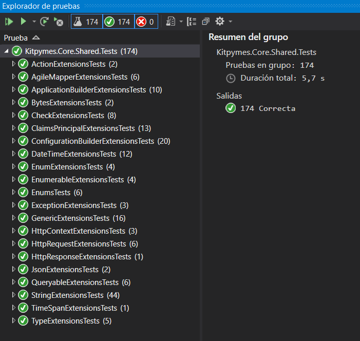

#  Kitpymes.Core.Shared

**Extensiones y utilidades comunes utilizadas en los proyectos**

[](https://github.com/kitpymes/template-netcore-shared/actions)
[](https://www.nuget.org/packages/Kitpymes.Core.Shared/)
[](https://www.nuget.org/stats/packages/Kitpymes.Core.Shared?groupby=Version)
[](https://github.com/kitpymes/template-netcore-shared/blob/master/docs/LICENSE.txt)
[](https://github.com/kitpymes/template-netcore-shared/)
[](https://github.com/kitpymes/template-netcore-shared/)

## 📋 Requerimientos 

* Visual Studio >= 2019 (v16.3)

* NET TargetFramework >= netcoreapp3.0

* Net Core SDK >= 3.0.100

* C# >= 8.0

* Conocimientos sobre Inyección de Dependencias

## 🔧 Instalación 

_Se puede instalar usando el administrador de paquetes Nuget o CLI dotnet._

_Nuget_

```
Install-Package Kitpymes.Core.Shared
```

_CLI dotnet_

```
dotnet add package Kitpymes.Core.Shared
```

## ⌨️ Código


### Extensions

```cs
public static class ActionExtensions
{
    public static TOptions ToConfigureOrDefault<TOptions>(this Action<TOptions>? action, TOptions? defaultOptions = null)
        where TOptions : class, new() 
    { }
}
```

```cs
public static class AgileMapperExtensions
{
    public static TSource ToMapClone<TSource>(this TSource source, params Expression<Action<IFullMappingInlineConfigurator<TSource, TSource>>>[] configurations)
        where TSource : class
    { }

    public static TDestination ToMapNew<TSource, TDestination>(this TSource source, params Expression<Action<IFullMappingInlineConfigurator<TSource, TDestination>>>[] configurations)
        where TSource : class
        where TDestination : class
    { }

    public static TDestination ToMapNew<TDestination>(this object source, params Expression<Action<IFullMappingInlineConfigurator<object, TDestination>>>[] configurations)
        where TDestination : class
    { }

    public static TDestination ToMapUpdate<TSource, TDestination>(this TSource source, TDestination destination, params Expression<Action<IFullMappingInlineConfigurator<TSource, TDestination>>>[] configurations)
        where TSource : class
        where TDestination : class
    { }

    public static TDestination ToMapMerge<TSource, TDestination>(this TSource source, TDestination destination, params Expression<Action<IFullMappingInlineConfigurator<TSource, TDestination>>>[] configurations)
        where TSource : class
        where TDestination : class
    { }

    public static IQueryable<TDestination> ToMapList<TSource, TDestination>(this IQueryable<TSource> queryable, Expression<Action<IFullProjectionInlineConfigurator<TSource, TDestination>>>? configuration = null)
        where TSource : class
        where TDestination : class
    { }
}
```

```cs
public static class ApplicationBuilderExtensions
{
    public static IWebHostEnvironment ToEnvironment(this IApplicationBuilder application) { }

    public static bool ToExists<TService>(this IApplicationBuilder application) { }
 
    public static TService ToService<TService>(this IApplicationBuilder application) { }
}
```

```cs
public static class ByteExtensions
{
    public static byte[] ToCompress(this byte[] bytes) { }

    public static byte[] ToDecompress(this byte[] bytes) { }

    public static TResult ToDecompress<TResult>(this byte[] bytes) { }

    public static TResult ToObject<TResult>(this byte[] bytes) { }
}
```

```cs
public static class CheckExtensions
{
    public static bool ToIsNullOrEmpty<TSource>(this TSource source) { }

    public static TSource ToThrowIfNullOrEmpty<TSource>([NotNull] this TSource source, string paramName) { }

    public static bool ToIsNullOrAny<TSource>(this IEnumerable<TSource> source) { }

    public static IEnumerable<TSource> ToThrowIfNullOrAny<TSource>([NotNull] this IEnumerable<TSource> source, string paramName) { }

    public static TSource ToThrowIfNotFound<TSource>([NotNull] this TSource source, string paramName) { }

    public static string? ToThrowIfNotFoundDirectory([NotNull] this string? source, string paramName) { }
  
    public static TSource ToThrow<TSource>([NotNull] this TSource source, Func<bool> predicate, string message) { }

    public static bool ToHasErrors<TSource>(this TSource source, Func<bool> predicate) { }
}
```

```cs
public static class ClaimsPrincipalExtensions
{
    public static bool ToIsAuthenticated(this ClaimsPrincipal claimsPrincipal) { }

    public static string? ToAuthenticationType(this ClaimsPrincipal claimsPrincipal) { }

    public static string ToUserName(this ClaimsPrincipal claimsPrincipal) { }

    public static bool ToExists(this ClaimsPrincipal claimsPrincipal, string claimType) { }

    public static void ToAdd(this ClaimsPrincipal claimsPrincipal, string authenticationType, IEnumerable<Claim> claims) { }

    public static void ToAdd<T>(this ClaimsPrincipal claimsPrincipal, string authenticationType, params (string claimType, T value)[] values) { }

    public static TResult? ToGet<TResult>(this ClaimsPrincipal claimsPrincipal, string claimType)
        where TResult : class
    { }

    public static TResult? ToGetValue<TResult>(this ClaimsPrincipal claimsPrincipal, string claimType)
        where TResult : struct
    { }

    public static IEnumerable<TResult>? ToGetAll<TResult>(this ClaimsPrincipal claimsPrincipal, string claimType) { }
}
```

```cs
public static class DateTimeExtensions
{
    public static bool ToIsWeekend(this DateTime input) { }

    public static int ToAge(this DateTime input) { }

    public static bool ToIsLastDayOfTheMonth(this DateTime input) { }

    public static DateTime ToEndOfTheMonth(this DateTime input) { }

    public static DateTime ToStartOfWeek(this DateTime input) { }

    public static DateTime ToYesterday(this DateTime input) { }

    public static DateTime ToTomorrow(this DateTime input) { }

    public static DateTime ToSetTime(this DateTime input, string time) { }

    public static DateTime ToSetTime(this DateTime input, int hours, int minutes, int seconds) { }
}
```

```cs
public static class EnumerableExtensions
{
    public static string ToString<T>(this IEnumerable<T> enumerable, string separator) { }

    public static IEnumerable<T> ToEmptyIfNull<T>(this IEnumerable<T>? enumerable) { }

    public static ReadOnlyCollection<T> ToReadOnly<T>(this IEnumerable<T> enumerable) { }

    public static IEnumerable<Assembly> ToAssembly(this IEnumerable<string> assemblies) { }
}
```

```cs
public static class EnumExtensions
{
    public static int ToValue(this Enum name) { }

    public static string? ToDescription(this Enum name) { }

    public static (string? name, string? description) ToDisplay(this Enum name) { }

    public static TAttribute? ToAttribute<TAttribute>(this Enum name)
        where TAttribute : Attribute
    { }
}
```

```cs
public static class ExceptionExtensions
{
    public static string ToMessage(this Exception exception) { }

    public static string ToFullMessage(this Exception exception) { }
}
```

```cs
public static class GenericExtensions
{
    public static object? ToDefaultValue<T>(this T value) { }

    public static byte[] ToBytes<T>(this T value)
        where T : class
    { }

    public static IDictionary ToDictionaryPropertyInfo<T>(this T input, bool includeNullOrEmptyProperty = false)
        where T : class
    { }
}
```

```cs
public static class HttpContextExtensions
{
    public static bool ToTryIPv6(this HttpContext httpContext, [MaybeNullWhen(false)] out string value) { }

    public static string? ToIPv6(this HttpContext httpContext) { }

    public static string ToDetails(this HttpContext httpContext, string? optionalData = null) { }
}
```

```cs
public static class HttpRequestExtensions
{
    public static bool ToTryHeader(this HttpRequest httpRequest, string key, [MaybeNullWhen(false)] out string value) { }

    public static string? ToHeader(this HttpRequest httpRequest, string key) { }

    public static string ToPath(this HttpRequest httpRequest) { }

    public static string? ToSubdomain(this HttpRequest httpRequest) { }
}
```

```cs
public static class HttpResponseExtensions
{
    public static async Task ToResultAsync(
        this HttpResponse httpResponse,
        HttpStatusCode status,
        string message,
        string contentType = MediaTypeNames.Application.Json,
        params (string key, string[] values)[] headers) { }
}
```

```cs
public static class JsonExtensions
{
    public static string ToSerialize<T>(this T value, Action<JsonSerializerOptions>? action = null) { }

    public static T ToDeserialize<T>(this string value, Action<JsonSerializerOptions>? action = null) { }
}
```

```cs
public static class QueryableExtensions
{
    public static IQueryable<T> ToWhere<T>(this IQueryable<T> queryable, Expression<Func<T, bool>>? where)
        where T : class
    { }

    public static IQueryable<T> ToPaged<T>(this IQueryable<T> queryable, string property, bool ascending = true, int index = 1, int size = 20) { }

    private static IQueryable<T> ToOrder<T>(this IQueryable<T> queryable, string property, bool ascending)
    { }

    private static IQueryable<T> ToOrder<T, TKey>(this IQueryable<T> queryable, IEnumerable<string> properties, bool ascending)
    { }
}
```

```cs
public static class ServiceCollectionExtensions
{
    public static IWebHostEnvironment ToEnvironment(this IServiceProvider services) { }

    public static IWebHostEnvironment ToEnvironment(this IServiceCollection services) { }

    public static bool ToExists<TService>(this IServiceCollection services) { }

    public static TService ToService<TService>(this IServiceCollection services) { }

    public static IServiceCollection ToServiceMatchingInterface(this IServiceCollection services, Assembly[] assemblies, ServiceLifetime lifetime = ServiceLifetime.Transient) { }

    public static IServiceCollection ToConfiguration(this IServiceCollection services, string directoryPath, params (string jsonFileName, bool optional, bool reloadOnChange)[] files) { }

    public static IServiceCollection ToConfiguration(this IServiceCollection services, params (string key, string? value)[] configuration)
    { }

    public static IServiceCollection ToConfiguration(this IServiceCollection services, IConfiguration configuration) { }

    public static TSettings ToSettings<TSettings>(this IServiceCollection services, Action<TSettings>? defaultSettings = null)
        where TSettings : class, new()
    { }

    public static TSettings ToSettings<TSettings, TConfigureSettings>(this IServiceCollection services, Action<TSettings>? defaultSettings = null)
        where TSettings : class, new()
        where TConfigureSettings : class, IConfigureOptions<TSettings>
    { }

    public static IServiceCollection ToSettings<TSettings>(this IServiceCollection services, TSettings? defaultSettings)
        where TSettings : class, new()
    { }
}
```

```cs
public static class StringExtensions
{
    public static string? ToReplace(this string? input, string replace = " ") { }

    public static string? ToReplace(this string? input, string replace, int start, int count) { }

    public static string? ToReplaceSpecialChars(this string? input, params string[] ignoreSpecialChars) { }

    public static string? ToNormalize(this string? input) { }

    public static TEnum ToEnum<TEnum>(this string? input, TEnum defaultValue = default)
        where TEnum : struct, Enum
    { }

    public static TEnum ToEnum<TEnum>(this int input, TEnum defaultValue = default)
        where TEnum : struct, Enum
    { }

    public static string? ToFirstLetterUpper(this string input) { }

    public static string? ToFirstLetterLower(this string input) { }

    public static string? ToEmailMaskUserName(this string? input, char replace = '*') { }

    public static string? ToEmailMaskUserNameAndDomain(this string? input, char replace = '*') { }

    public static string? ToEmailMaskUserNameAndDomainAndExtension(this string? input, char replace = '*') { }

    public static string? ToEmailMask(this string? input, string pattern, char replace) { }

    public static Uri? ToUri(this string? input, Uri? defaultValue = null) { }

    public static HashAlgorithmName? ToHashAlgorithmName(this string? input, HashAlgorithmName? defaultValue = null) { }

    public static int? ToInt(this string? input, int? defaultValue = null) { }

    /// <param name="removeSourceDirectoryPath">Si queremos remover el directorio.</param>
    public static void ToZipCreate(
        this string? sourceDirectoryPath,
        string? destinationDirectoryPath,
        string? customZipName = null,
        CompressionLevel compressionLevel = CompressionLevel.Optimal,
        bool removeSourceDirectoryPath = false) { }

    public static void ToZipExtract(
        this string? sourceFilePath,
        string? destinationDirectoryPath,
        bool overwriteFiles = false) { }

    public static string ToContentType(this string? fileName, string defaultValue = MediaTypeNames.Application.Octet) { }

    public static bool ToDirectoryExists(this string? directoryPath) { }

    public static string? ToDirectoryFindFilePath(this string? directoryPath, string fileName, bool ignoreCase = true) { }

    public static FileInfo? ToDirectoryFileInfo(this string? directoryPath, string fileName) { }

    public static void ToDirectoryDeleteFiles(this string directoryPath, bool recursive = false, bool directoryDelete = false) { }

    public static async Task ToDirectorySaveFileAsync(this string directoryPath, string fileName, byte[] bytes, bool ifNoExistDirectoryCreate = true) { }

    public static async Task<(string fileName, string filePath, string fileConvert, byte[] fileBytes, long fileLength, string fileContentType)?> ToDirectoryReadFileAsync(
        this string directoryPath,
        string fileName) { }

    public static async Task<List<(string fileName, string filePath, string fileConvert, byte[] fileBytes, long fileLength, string fileContentType)?>?> ToDirectoryReadFilesAsync(
        this string directoryPath,
        SearchOption searchOption = SearchOption.AllDirectories,
        params string[] includeExtensions) { }

    public static string ToDirectoryTemporary(this string folderName) { }

    public static bool ToFileExists(this string? filePath) { }

    public static string ToFormat(this string value, params object[] args) { }

    public static string ToFormat(this string value, IFormatProvider formatProvider, params object[] args) { }

    public static Assembly ToAssembly(this string assembly) { }
}
```

```cs
public static class TimeSpanExtensions
{
    public static string ToFormat(this TimeSpan time) { }
}
```

```cs
public static class TypeExtensions
{
    public static object? ToDefaultValue(this Type type) { }

    public static IDictionary? ToDictionary(this Type type) { }

    public static Assembly ToAssembly(this Type type) { }
}
```

### Utilities

```cs
public static class Enums
{
    public static int ToCount<TEnum>()
        where TEnum : Enum
    { }

    public static IEnumerable<string?> ToValues<TEnum>()
            where TEnum : struct, Enum
    { }

    public static IEnumerable<(int value, string text, bool selected)> ToList<TEnum>(Type? resourceType = null, TEnum? selected = null)
            where TEnum : struct, Enum
    { }
}
```

```cs
public static class Exceptions
{
    public static ApplicationException ToThrow(string message) { }

    public static ApplicationException ToThrow(Exception exception) { }
}
```

```cs
public static class Messages
{
    public static string NullOrEmpty(string paramName) => $"{paramName} is null or empty";

    public static string NullOrAny(string paramName) => $"{paramName} is null or not values";

    public static string NotFound(string paramName) => $"{paramName} is not found";
}
```

## ⚙️ Pruebas Unitarias

_Cada proyecto tiene su test que se ejecutan desde el "Explorador de pruebas"_




## 🛠️ Construido con 

* [NET Core](https://dotnet.microsoft.com/download) - Framework de trabajo
* [C#](https://docs.microsoft.com/es-es/dotnet/csharp/) - Lenguaje de programación
* [Inserción de dependencias](https://docs.microsoft.com/es-es/aspnet/core/fundamentals/dependency-injection?view=aspnetcore-3.0) - Patrón de diseño de software
* [MSTest](https://docs.microsoft.com/es-es/dotnet/core/testing/unit-testing-with-mstest) - Pruebas unitarias
* [Nuget](https://www.nuget.org/) - Manejador de dependencias
* [Visual Studio](https://visualstudio.microsoft.com/) - Entorno de programacion


## ✒️ Autores 

* **Sebastian R Ferrari** - *Trabajo Inicial* - [kitpymes](https://kitpymes.com)


## 📄 Licencia 

* Este proyecto está bajo la Licencia [LICENSE](LICENSE.txt)


## 🎁 Gratitud 

* Este proyecto fue diseñado para compartir, creemos que es la mejor forma de ayudar 📢
* Cada persona que contribuya sera invitada a tomar una 🍺 
* Gracias a todos! 🤓

---
[Kitpymes](https://github.com/kitpymes) 😊