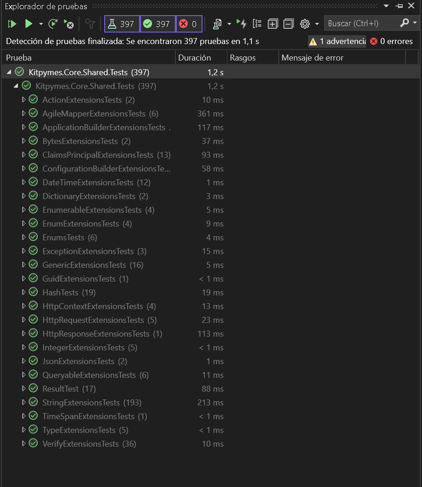

#  Kitpymes.Core.Shared

**Extensiones y utilidades comunes compartidas en los proyectos**

[](https://github.com/kitpymes/template-netcore-shared/actions)
[](https://www.nuget.org/packages/Kitpymes.Core.Shared/)
[](https://www.nuget.org/stats/packages/Kitpymes.Core.Shared?groupby=Version)
[](https://github.com/kitpymes/template-netcore-shared/blob/master/docs/LICENSE.txt)
[](https://github.com/kitpymes/template-netcore-shared/)
[](https://github.com/kitpymes/template-netcore-shared/)

## 📋 Requerimientos 

* Visual Studio >= 2019 (v16.3)

* NET TargetFramework >= netcoreapp3.0

* Net Core SDK >= 3.0.100

* C# >= 8.0

* Conocimientos sobre Inyección de Dependencias

## 🔧 Instalación 

_Se puede instalar usando el administrador de paquetes Nuget o CLI dotnet._

_Nuget_

```
Install-Package Kitpymes.Core.Shared
```

_CLI dotnet_

```
dotnet add package Kitpymes.Core.Shared
```

## ⌨️ Código


### Extensions

```cs
public static class ActionExtensions
{
    public static TOptions ToConfigureOrDefault<TOptions>(this Action<TOptions>? action, TOptions? defaultOptions = null)
        where TOptions : class, new() 
    { }
}
```

```cs
public static class AgileMapperExtensions
{
    public static TSource ToMapClone<TSource>(this TSource source, params Expression<Action<IFullMappingInlineConfigurator<TSource, TSource>>>[] configurations)
        where TSource : class
    { }

    public static TDestination ToMapNew<TSource, TDestination>(this TSource source, params Expression<Action<IFullMappingInlineConfigurator<TSource, TDestination>>>[] configurations)
        where TSource : class
        where TDestination : class
    { }

    public static TDestination ToMapNew<TDestination>(this object source, params Expression<Action<IFullMappingInlineConfigurator<object, TDestination>>>[] configurations)
        where TDestination : class
    { }

    public static TDestination ToMapUpdate<TSource, TDestination>(this TSource source, TDestination destination, params Expression<Action<IFullMappingInlineConfigurator<TSource, TDestination>>>[] configurations)
        where TSource : class
        where TDestination : class
    { }

    public static TDestination ToMapMerge<TSource, TDestination>(this TSource source, TDestination destination, params Expression<Action<IFullMappingInlineConfigurator<TSource, TDestination>>>[] configurations)
        where TSource : class
        where TDestination : class
    { }

    public static IQueryable<TDestination> ToMapList<TSource, TDestination>(this IQueryable<TSource> queryable, Expression<Action<IFullProjectionInlineConfigurator<TSource, TDestination>>>? configuration = null)
        where TSource : class
        where TDestination : class
    { }
}
```

```cs
public static class ApplicationBuilderExtensions
{
    public static IWebHostEnvironment ToEnvironment(this IApplicationBuilder application) { }

    public static bool ToExists<TService>(this IApplicationBuilder application) { }
 
    public static TService ToService<TService>(this IApplicationBuilder application) { }
}
```

```cs
public static class ByteExtensions
{
    public static byte[] ToCompress(this byte[] bytes) { }

    public static byte[] ToDecompress(this byte[] bytes) { }

    public static TResult ToDecompress<TResult>(this byte[] bytes) { }

    public static TResult ToObject<TResult>(this byte[] bytes) { }
}
```

```cs
public static class CheckExtensions
{
    public static bool ToIsNullOrEmpty(this object? source) {}

    public static TSource ToIsNullOrEmptyWithMessageThrow<TSource>(this TSource source, string message) {}

    public static TSource ToIsNullOrEmptyThrow<TSource>(this TSource source, string paramName) {}

    public static bool ToIsNullOrAny<TSource>(this IEnumerable<TSource>? input) {}

    public static IEnumerable<TSource> ToIsNullOrAnyWithMessageThrow<TSource>(his IEnumerable<TSource> source, string message) {}

    public static IEnumerable<TSource> ToIsNullOrAnyThrow<TSource>(this IEnumerable<TSource> source, string paramName) {}

    public static bool ToIsGreater(this object? source, long max) {}

    public static TSource ToIsGreaterWithMessageThrow<TSource>(this TSource source, long max, string message) {}

    public static TSource ToIsGreaterThrow<TSource>(this TSource source, long max, string paramName) {}

    public static bool ToIsLess(this object? source, long min) {}

    public static TSource ToIsLessWithMessageThrow<TSource>(this TSource source, long min, string message) {}

    public static TSource ToIsLessThrow<TSource>(this TSource source, long min, string paramName) {}

    public static bool ToIsEqual(this object? source, object? compare) {}

    public static TSource ToIsEqualWithMessageThrow<TSource>(this TSource source, TSource compare, string message) {}

    public static TSource ToIsEqualThrow<TSource>(this TSource source, TSource compare, string paramName, string paramNameCompare) {}

    public static bool ToIsRange(this object? source, long min, long max) {}

    public static TSource ToIsRangeWithMessageThrow<TSource>(this TSource source, long min, long max, string message) {}

    public static TSource ToIsRangeThrow<TSource>(this TSource source, long min, long max, string paramName) {}

    public static bool ToIsRegexMatch(this string? source, string regex) {}

    public static string ToIsRegexMatchWithMessageThrow(this string? source, string regex, string message) {}

    public static string ToIsRegexMatchThrow(this string? source, string regex, string paramName) {}

    public static bool ToIsName(this string? source) {}

    public static string ToIsNameWithMessageThrow(this string? source, string message) {}

    public static string ToIsNameThrow(this string? source, string paramName) {}

    public static bool ToIsEmail(this string? source) {}

    public static string ToIsEmailWithMessageThrow(this string? source, string message) {}

    public static string ToIsEmailThrow(this string? source, string paramName) {}

    public static bool ToIsDirectory(this string? input) {}

    public static string? ToIsDirectoryWithMessageThrow(this string? source, string message) {}

    public static string? ToIsDirectoryThrow(this string? source, string paramName) {}

    public static bool ToIsFile(this string? input) {}

    public static string ToIsFileWithMessageThrow(this string? source, string message) {}

    public static string ToIsFileThrow(this string? source, string paramName) {}

    public static bool ToIsFileExtension(this string? input) {}

    public static string ToIsFileExtensionWithMessageThrow(this string? source, string message) {}

    public static string ToIsFileExtensionThrow(this string? source, string paramName) {}

    public static bool ToIsSubdomain(this string? source) {}

    public static string ToIsSubdomainWithMessageThrow(this string? source, string message) {}

    public static string ToIsSubdomainThrow(this string? source, string paramName) {}

    public static bool ToIsDomain(this string? source) {}

    public static string ToIsDomainWithMessageThrow(this string? source, string message) {}

    public static string ToIsDomainThrow(this string? source, string paramName) {}

    public static bool ToIsHostname(this string? source) {}

    public static string ToIsHostnameWithMessageThrow(this string? source, string message) {}

    public static string ToIsHostnameThrow(this string? source, string paramName) {}

    public static bool ToIsDigit(this string? source) {}

    public static string ToIsDigitWithMessageThrow(this string? source, string message) {}

    public static string ToIsDigitThrow(this string? source, string paramName) {}

    public static bool ToIsUniqueChars(this string? source) {}

    public static string ToIsUniqueCharsWithMessageThrow(this string? source, string message) {}

    public static string ToIsUniqueCharsThrow(this string? source, string paramName) {}

    public static bool ToIsEspecialChars(this string? source) {}

    public static string ToIsEspecialCharsWithMessageThrow(this string? source, string message) {}

    public static string ToIsEspecialCharsThrow(this string? source, string paramName) {}

    public static bool ToIsLowercase(this string? source) {}

    public static string ToIsLowercaseWithMessageThrow(this string? source, string message) {}

    public static string ToIsLowercaseThrow(this string? source, string paramName) {}

    public static bool ToIsUppercase(this string? source) {}

    public static string ToIsUppercaseWithMessageThrow(this string? source, string message) {}

    public static string ToIsUppercaseThrow(this string? source, string paramName) {}

    public static TSource ToIsThrow<TSource>(this TSource source, Func<bool> predicate, string message) {}

    public static bool ToIsErrors<TSource>(this TSource source, Func<bool> predicate) {}
}
```

```cs
public static class ClaimsPrincipalExtensions
{
    public static bool ToIsAuthenticated(this ClaimsPrincipal claimsPrincipal) { }

    public static string? ToAuthenticationType(this ClaimsPrincipal claimsPrincipal) { }

    public static string ToUserName(this ClaimsPrincipal claimsPrincipal) { }

    public static bool ToExists(this ClaimsPrincipal claimsPrincipal, string claimType) { }

    public static void ToAdd(this ClaimsPrincipal claimsPrincipal, string authenticationType, IEnumerable<Claim> claims) { }

    public static void ToAdd<T>(this ClaimsPrincipal claimsPrincipal, string authenticationType, params (string claimType, T value)[] values) { }

    public static TResult? ToGet<TResult>(this ClaimsPrincipal claimsPrincipal, string claimType)
        where TResult : class
    { }

    public static TResult? ToGetValue<TResult>(this ClaimsPrincipal claimsPrincipal, string claimType)
        where TResult : struct
    { }

    public static IEnumerable<TResult>? ToGetAll<TResult>(this ClaimsPrincipal claimsPrincipal, string claimType) { }
}
```

```cs
public static class DateTimeExtensions
{
    public static bool ToIsWeekend(this DateTime input) { }

    public static int ToAge(this DateTime input) { }

    public static bool ToIsLastDayOfTheMonth(this DateTime input) { }

    public static DateTime ToEndOfTheMonth(this DateTime input) { }

    public static DateTime ToStartOfWeek(this DateTime input) { }

    public static DateTime ToYesterday(this DateTime input) { }

    public static DateTime ToTomorrow(this DateTime input) { }

    public static DateTime ToSetTime(this DateTime input, string time) { }

    public static DateTime ToSetTime(this DateTime input, int hours, int minutes, int seconds) { }
}
```

```cs
public static class EnumerableExtensions
{
    public static string ToString<T>(this IEnumerable<T> enumerable, string separator) { }

    public static IEnumerable<T> ToEmptyIfNull<T>(this IEnumerable<T>? enumerable) { }

    public static ReadOnlyCollection<T> ToReadOnly<T>(this IEnumerable<T> enumerable) { }

    public static IEnumerable<Assembly> ToAssembly(this IEnumerable<string> assemblies) { }
}
```

```cs
public static class EnumExtensions
{
    public static int ToValue(this Enum name) { }

    public static string? ToDescription(this Enum name) { }

    public static (string? name, string? description) ToDisplay(this Enum name) { }

    public static TAttribute? ToAttribute<TAttribute>(this Enum name)
        where TAttribute : Attribute
    { }
}
```

```cs
public static class ExceptionExtensions
{
    public static string ToMessage(this Exception exception) { }

    public static string ToFullMessage(this Exception exception) { }
}
```

```cs
public static class GenericExtensions
{
    public static object? ToDefaultValue<T>(this T value) { }

    public static byte[] ToBytes<T>(this T value)
        where T : class
    { }

    public static IDictionary ToDictionaryPropertyInfo<T>(this T input, bool includeNullOrEmptyProperty = false)
        where T : class
    { }
}
```

```cs
public static class HttpContextExtensions
{
    public static bool ToTryIPv6(this HttpContext httpContext, [MaybeNullWhen(false)] out string value) { }

    public static string? ToIPv6(this HttpContext httpContext) { }

    public static string ToDetails(this HttpContext httpContext, string? optionalData = null) { }
}
```

```cs
public static class HttpRequestExtensions
{
    public static bool ToTryHeader(this HttpRequest httpRequest, string key, [MaybeNullWhen(false)] out string value) { }

    public static string? ToHeader(this HttpRequest httpRequest, string key) { }

    public static string ToPath(this HttpRequest httpRequest) { }

    public static string? ToSubdomain(this HttpRequest httpRequest) { }

    public static bool ToTryContentType(this HttpRequest httpRequest, [MaybeNullWhen(false)] out string? value) { }
}
```

```cs
public static class HttpResponseExtensions
{
    public static async Task ToResultAsync(
        this HttpResponse httpResponse,
        HttpStatusCode status,
        string message,
        string contentType = MediaTypeNames.Application.Json,
        params (string key, string[] values)[] headers) { }
}
```

```cs
public static class IntegerExtensions
{
    [return: NotNull]
    public static string ToStringFormat(this int input, IFormatProvider? formatProvider = null) { }
}
```

```cs
public static class JsonExtensions
{
    public static string ToSerialize<T>(this T value, Action<JsonSerializerOptions>? action = null) { }

    public static T ToDeserialize<T>(this string value, Action<JsonSerializerOptions>? action = null) { }
}
```

```cs
public static class QueryableExtensions
{
    public static IQueryable<T> ToWhere<T>(this IQueryable<T> queryable, Expression<Func<T, bool>>? where)
        where T : class
    { }

    public static IQueryable<T> ToPaged<T>(this IQueryable<T> queryable, string property, bool ascending = true, int index = 1, int size = 20) { }
}
```

```cs
public static class ServiceCollectionExtensions
{
    public static IWebHostEnvironment ToEnvironment(this IServiceProvider services) { }

    public static IWebHostEnvironment ToEnvironment(this IServiceCollection services) { }

    public static bool ToExists<TService>(this IServiceCollection services) { }

    public static TService ToService<TService>(this IServiceCollection services) { }

    public static IServiceCollection ToServiceMatchingInterface(this IServiceCollection services, Assembly[] assemblies, ServiceLifetime lifetime = ServiceLifetime.Transient) { }

    public static IServiceCollection ToConfiguration(this IServiceCollection services, string directoryPath, params (string jsonFileName, bool optional, bool reloadOnChange)[] files) { }

    public static IServiceCollection ToConfiguration(this IServiceCollection services, params (string key, string? value)[] configuration) { }

    public static IServiceCollection ToConfiguration(this IServiceCollection services, IConfiguration configuration) { }

    public static TSettings ToSettings<TSettings>(this IServiceCollection services, Action<TSettings>? defaultSettings = null)
        where TSettings : class, new()
    { }

    public static TSettings ToSettings<TSettings, TConfigureSettings>(this IServiceCollection services, Action<TSettings>? defaultSettings = null)
        where TSettings : class, new()
        where TConfigureSettings : class, IConfigureOptions<TSettings>
    { }

    public static IServiceCollection ToSettings<TSettings>(this IServiceCollection services, TSettings? defaultSettings)
        where TSettings : class, new()
    { }
}
```

```cs
public static class StringExtensions
{
    public static string? ToReplace(this string? input, string replace = " ") { }

    public static string? ToReplace(this string? input, string replace, int start, int count) { }

    public static string? ToReplaceSpecialChars(this string? input, params string[] ignoreSpecialChars) { }

    public static string? ToNormalize(this string? input) { }

    public static TEnum ToEnum<TEnum>(this string? input, TEnum defaultValue = default)
        where TEnum : struct, Enum
    { }

    public static TEnum ToEnum<TEnum>(this int input, TEnum defaultValue = default)
        where TEnum : struct, Enum
    { }

    public static string? ToFirstLetterUpper(this string input) { }

    public static string? ToFirstLetterLower(this string input) { }

    public static string? ToEmailMaskUserName(this string? input, char replace = '*') { }

    public static string? ToEmailMaskUserNameAndDomain(this string? input, char replace = '*') { }

    public static string? ToEmailMaskUserNameAndDomainAndExtension(this string? input, char replace = '*') { }

    public static string? ToEmailMask(this string? input, string pattern, char replace) { }

    public static Uri? ToUri(this string? input, Uri? defaultValue = null) { }

    public static HashAlgorithmName? ToHashAlgorithmName(this string? input, HashAlgorithmName? defaultValue = null) { }

    public static int? ToInt(this string? input, int? defaultValue = null) { }

    public static void ToZipCreate(
        this string? sourceDirectoryPath,
        string? destinationDirectoryPath,
        string? customZipName = null,
        CompressionLevel compressionLevel = CompressionLevel.Optimal,
        bool removeSourceDirectoryPath = false) { }

    public static void ToZipExtract(
        this string? sourceFilePath,
        string? destinationDirectoryPath,
        bool overwriteFiles = false) { }

    public static string ToContentType(this string? fileName, string defaultValue = MediaTypeNames.Application.Octet) { }

    public static string? ToDirectoryFindFilePath(this string? directoryPath, string fileName, bool ignoreCase = true) { }

    public static FileInfo? ToDirectoryFileInfo(this string? directoryPath, string fileName) { }

    public static void ToDirectoryDeleteFiles(this string directoryPath, bool recursive = false, bool directoryDelete = false) { }

    public static async Task ToDirectorySaveFileAsync(this string directoryPath, string fileName, byte[] bytes, bool ifNoExistDirectoryCreate = true) { }

    public static async Task<(string fileName, string filePath, string fileConvert, byte[] fileBytes, long fileLength, string fileContentType)?> ToDirectoryReadFileAsync(
        this string directoryPath,
        string fileName) { }

    public static async Task<List<(string fileName, string filePath, string fileConvert, byte[] fileBytes, long fileLength, string fileContentType)?>?> ToDirectoryReadFilesAsync(
        this string directoryPath,
        SearchOption searchOption = SearchOption.AllDirectories,
        params string[] includeExtensions) { }

    public static string ToDirectoryTemporary(this string folderName) { }

    public static string ToFormat(this string value, params object[] args) { }

    public static string ToFormat(this string value, IFormatProvider formatProvider, params object[] args) { }

    public static Assembly ToAssembly(this string assembly) { }
}
```

```cs
public static class TimeSpanExtensions
{
    public static string ToFormat(this TimeSpan time) { }
}
```

```cs
public static class TypeExtensions
{
    public static object? ToDefaultValue(this Type type) { }

    public static IDictionary? ToDictionary(this Type type) { }

    public static Assembly ToAssembly(this Type type) { }
}
```

### Utilities

```cs
public static class Check
{
    public static (bool HasErrors, int Count) IsNullOrEmpty(params object?[] values) {}

    public static (bool HasErrors, int Count) IsNullOrAny(params IEnumerable?[] values) {}

    public static (bool HasErrors, int Count) IsGreater(long max, params object?[] values) {}

    public static (bool HasErrors, int Count) IsLess(long min, params object?[] values) {}

    public static (bool HasErrors, int Count) IsEqual(object? value, params object?[] valuesCompare) {}

    public static (bool HasErrors, int Count) IsRange(long min, long max, params object?[] values) {}

    public static (bool HasErrors, int Count) IsRegexMatch(string regex, params string?[] values) {}

    public static (bool HasErrors, int Count) IsCustom(params Func<bool>[] values) {}

    public static (bool HasErrors, int Count) IsName(params string?[] values) {}

    public static (bool HasErrors, int Count) IsEmail(params string?[] values) {}

    public static (bool HasErrors, int Count) IsDirectory(params string?[] values) {}

    public static (bool HasErrors, int Count) IsFile(params string?[] values) {}

    public static (bool HasErrors, int Count) IsFileExtension(params string?[] values) {}

    public static (bool HasErrors, int Count) IsSubdomain(params string?[] values) {}

    public static (bool HasErrors, int Count) IsDomain(params string?[] values) {}

    public static (bool HasErrors, int Count) IsHostname(params string?[] values) {}

    public static (bool HasErrors, int Count) IsDigit(params string?[] values) {}

    public static (bool HasErrors, int Count) IsUniqueChars(params string?[] values) {}

    public static (bool HasErrors, int Count) IsEspecialChars(params string?[] values) {}

    public static (bool HasErrors, int Count) IsLowercase(params string?[] values) {}

    public static (bool HasErrors, int Count) IsUppercase(params string?[] values) {}

    public static void Throw(string error) {}

    public static void Throw(IEnumerable<string> errors) {}
}
```

```cs
public static class Regexp
{
    public const string ForDate = @"^((((0?[1-9]|[12]\d|3[01])[\.\-\/](0?[13578]|1[02])[\.\-\/]((1[6-9]|[2-9]\d)?\d{2}))|((0?[1-9]|[12]\d|30)[\.\-\/](0?[13456789]|1[012])[\.\-\/]((1[6-9]|[2-9]\d)?\d{2}))|((0?[1-9]|1\d|2[0-8])[\.\-\/]0?2[\.\-\/]((1[6-9]|[2-9]\d)?\d{2}))|(29[\.\-\/]0?2[\.\-\/]((1[6-9]|[2-9]\d)?(0[48]|[2468][048]|[13579][26])|((16|[2468][048]|[3579][26])00)|00)))|(((0[1-9]|[12]\d|3[01])(0[13578]|1[02])((1[6-9]|[2-9]\d)?\d{2}))|((0[1-9]|[12]\d|30)(0[13456789]|1[012])((1[6-9]|[2-9]\d)?\d{2}))|((0[1-9]|1\d|2[0-8])02((1[6-9]|[2-9]\d)?\d{2}))|(2902((1[6-9]|[2-9]\d)?(0[48]|[2468][048]|[13579][26])|((16|[2468][048]|[3579][26])00)|00)))) ?((20|21|22|23|[01]\d|\d)(([:.][0-5]\d){1,2}))?$";

    public const string ForDecimal = @"^((-?[1-9]+)|[0-9]+)(\.?|\,?)([0-9]*)$";

    public const string ForEmail = @"^([\w\.\-]+)@([\w\-]+)((\.(\w){2,3})+)$";

    public const string ForHex = "^#?([a-f0-9]{6}|[a-f0-9]{3})$";

    public const string ForInteger = "^((-?[1-9]+)|[0-9]+)$";

    public const string ForTag = @"^<([a-z1-6]+)([^<]+)*(?:>(.*)<\/\1>| *\/>)$";

    public const string ForTime = @"^([01]?[0-9]|2[0-3]):[0-5][0-9]$";

    public const string ForUrl = @"^((https?|ftp|file):\/\/)?([\da-z\.-]+)\.([a-z\.]{2,6})([\/\w \.-]*)*\/?$";

    public const string ForName = @"^[a-zA-Z áàäâãÁÀÄÂÃÅéèëêÉÈËÊíìïîÍÌÏÎóòöôõøÓÒÖÔÕúùüûÚÙÜÛçÇħñÑ]*$";

    public const string ForSubdomain = @"^[a-zA-Z0-9_-.]*$";

    public const string ForDomain = @"(?=^.{1,254}$)(^(?:(?!\d+\.|-)[a-zA-Z0-9_\-]{1,63}(?<!-)\.?)+(?:[a-zA-Z]{2,})$)";

    public const string ForHostname = @"^(([a-zA-Z0-9]|[a-zA-Z0-9][a-zA-Z0-9\-]*[a-zA-Z0-9])\.)*([A-Za-z0-9]|[A-Za-z0-9][A-Za-z0-9\-]*[A-Za-z0-9])$";
}
```

```cs
public static class Enums
{
    public static int ToCount<TEnum>()
        where TEnum : Enum
    { }

    public static IEnumerable<string?> ToValues<TEnum>()
            where TEnum : struct, Enum
    { }

    public static IEnumerable<(int value, string text, bool selected)> ToList<TEnum>(Type? resourceType = null, TEnum? selected = null)
            where TEnum : struct, Enum
    { }
}
```

```cs
public static class Hash
{
    public static string CreateRandom(int length = 6, string validChars = "ABCDEFGHJKLMNOPQRSTUVWXYZ0123456789abcdefghijklmnopqrstuvwxyz!¡@#$%€^&*?¿_-+") { }

    public static string CreateSHA256(string text) { }

    public static bool VerifySHA256(string text, string hash) { }

    public static string CreateSHA512(string text) { }

    public static bool VerifySHA512(string text, string hash) { }
}
```

```cs
public static class Messages
{
    public static string NullOrEmpty(string paramName) => $"{paramName} is null or empty";

    public static string NullOrAny(string paramName) => $"{paramName} is null or not values";

    public static string NotFound(string valueOrParamName) => $"{valueOrParamName} is not found";

    public static string InvalidFormat(string valueOrParamName) => $"{valueOrParamName} has invalid format";

    public static string NotEquals(string paramName, string paramNameCompare) => $"{paramName} and {paramNameCompare} not equals";

    public static string AlreadyExists(string valueOrParamName) => $"{valueOrParamName} already exists";

    public static string Less(string paramName, long min) => $"{paramName} must be greater than {min}";

    public static string Greater(string paramName, long max) => $"{paramName} must be less than {max}";

    public static string Range(string paramName, long min, long max) => $"{paramName} must be in the range {min} to {max}";
}
```

```cs
public interface IResult
{
    bool Success { get; }

    int? Status { get; }

    string? Title { get; }

    string? Message { get; }

    object? Details { get; }

    string? TraceId { get; }

    string? ExceptionType { get; }

    public IDictionary<string, IList<string>>? Errors { get; }

    string ToJson();
}
```

```cs
public interface IResult{T} : IResult
{
    T Data { get; }
}
```

```cs
public class ErrorOptions
{
    public ErrorOptions WithTitle(string title) {}

    public ErrorOptions WithStatusCode(HttpStatusCode status) {}

    public ErrorOptions WithDetails(object details) {}

    public ErrorOptions WithExceptionType(string exception = DefaultException) {}

    public ErrorOptions WithMessages(string message) {}

    public ErrorOptions WithMessages(IEnumerable<string> messages) {}

    public ErrorOptions WithErrors(string fieldName, string message) {}

    public ErrorOptions WithErrors(IEnumerable<(string fieldName, string message)> errors) {}
}
```

```cs
public class Result : IResult
{
    protected Result(bool success, int status, string title, string? message = null) {}

    public bool Success { get; protected set; }

    public int? Status { get; protected set; }

    public string? Title { get; protected set; }

    public string? Message { get; protected set; }

    public string? TraceId { get; protected set; }

    public string? ExceptionType { get; protected set; }

    public object? Details { get; protected set; }

    public IDictionary<string, IList<string>>? Errors { get; protected set; }

	
    public static Result Ok(string? message = null) { }

    public static Result Error(string? message = null, object? details = null) {}

    public static Result Error(Action<ErrorOptions> options) {}

    public virtual string ToJson() {}
}
```

```cs
public class Result<T> : Result, IResult<T>
{
    protected Result(bool success, int status, string title, string? message = null) {}

    ppublic T Data { get; private set; }

    public static new Result<T> Ok(string? message = null) {}

    public static Result<T> Ok(T data, string? message = null) {}

    public static new Result<T> Error(string? message = null, object? details = null) {}

    public static new Result<T> Error(Action<ErrorOptions> options) {}

    public override string ToJson() {}
}
```

## ⚙️ Pruebas Unitarias

_Cada proyecto tiene su test que se ejecutan desde el "Explorador de pruebas"_




## 🛠️ Construido con 

* [NET Core](https://dotnet.microsoft.com/download) - Framework de trabajo
* [C#](https://docs.microsoft.com/es-es/dotnet/csharp/) - Lenguaje de programación
* [Inserción de dependencias](https://docs.microsoft.com/es-es/aspnet/core/fundamentals/dependency-injection?view=aspnetcore-3.0) - Patrón de diseño de software
* [MSTest](https://docs.microsoft.com/es-es/dotnet/core/testing/unit-testing-with-mstest) - Pruebas unitarias
* [Nuget](https://www.nuget.org/) - Manejador de dependencias
* [Visual Studio](https://visualstudio.microsoft.com/) - Entorno de programacion


## ✒️ Autores 

* **Sebastian R Ferrari** - *Trabajo Inicial* - [kitpymes](https://kitpymes.com)


## 📄 Licencia 

* Este proyecto está bajo la Licencia [LICENSE](LICENSE.txt)


## 🎁 Gratitud 

* Este proyecto fue diseñado para compartir, creemos que es la mejor forma de ayudar 📢
* Cada persona que contribuya sera invitada a tomar una 🍺 
* Gracias a todos! 🤓

---
[Kitpymes](https://github.com/kitpymes) 😊